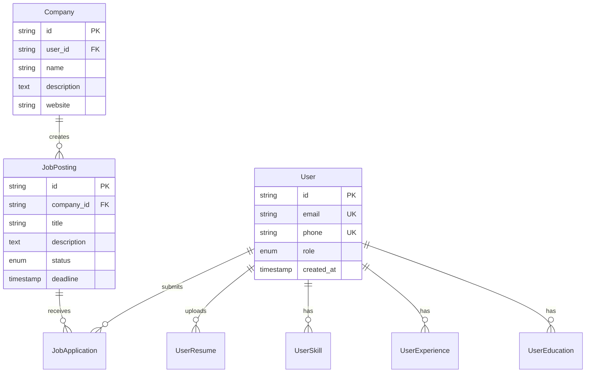

# 🚀 Modern Hiring Platform API

<div align="center">


_A comprehensive, enterprise-grade hiring platform backend built with modern technologies and best practices_

[Features](#-features) • [Quick Start](#-quick-start) • [API Documentation](#-api-documentation) • [Architecture](#-architecture) • [Deployment](#-deployment)

</div>

---

## 📋 Table of Contents

- [🎯 Overview](#-overview)
- [✨ Features](#-features)
- [🏗️ Architecture](#️-architecture)
- [🚀 Quick Start](#-quick-start)
- [🔧 Configuration](#-configuration)
- [📚 API Documentation](#-api-documentation)
- [🧪 Testing](#-testing)
- [🚢 Deployment](#-deployment)
- [📖 Documentation](#-documentation)
- [🤝 Contributing](#-contributing)

## 🎯 Overview

This modern hiring platform API provides a comprehensive solution for managing recruitment processes, from job postings to applicant tracking. Built with **NestJS** and **TypeScript**, it offers enterprise-grade features including real-time caching, document processing, and secure authentication.

### 🎪 Live Demo

- **API Health Check**: `GET /` → Returns "Hello World!"
- **Swagger Documentation**: `GET /swagger` (Development only)
- **Interactive API Explorer**: Available when running locally

### 🏆 Key Highlights

- ⚡ **High Performance**: Redis caching with cache-aside pattern
- 🔒 **Security First**: JWT authentication, rate limiting, input validation
- 🌐 **Cloud Ready**: AWS S3/MinIO integration for file storage
- 🐳 **Container Native**: Docker & Podman support with multi-stage builds
- 🔍 **Observability**: Structured logging and health monitoring
- 📊 **Test Coverage**: Comprehensive unit testing

## ✨ Features

### 👤 User Management

- **Multi-role Authentication**: Owner, Company, Individual users
- **Profile Management**: Comprehensive user profiles with resume handling
- **Skill & Experience Tracking**: Professional background management
- **Document Upload**: Resume and certification file handling

### 🏢 Company Operations

- **Company Profiles**: Detailed company information and branding
- **Job Posting Management**: Create, update, and manage job listings
- **Application Tracking**: ATS (Applicant Tracking System) functionality
- **Candidate Scoring**: Automated and manual candidate evaluation

### 📄 Document Processing

- **File Storage**: Secure cloud storage with AWS S3/MinIO
- **Format Support**: PDF, image files with automatic processing
- **Resume Upload**: Professional document management

### 🚀 Technical Features

- **RESTful API**: Clean, consistent API design with OpenAPI/Swagger
- **Real-time Caching**: Redis-powered caching for optimal performance
- **Rate Limiting**: Configurable API rate limiting (100 req/min default)
- **Data Validation**: Comprehensive DTO validation with class-validator
- **Error Handling**: Structured error responses with detailed logging
- **Health Monitoring**: Built-in health checks and observability

## 🏗️ Architecture

### 🎨 Design Patterns

Our platform implements proven enterprise patterns:

- **🗄️ Repository Pattern**: Clean data access abstraction
- **⚙️ Service Layer**: Business logic orchestration
- **🎯 Strategy Pattern**: Flexible scoring algorithms (ATS vs Manual)
- **🔌 Adapter Pattern**: External service integration (S3, Redis)
- **💾 Cache-Aside**: Performance optimization with Redis
- **🛡️ Dependency Injection**: Loose coupling and testability

### 📊 Database Design



### 🏛️ Application Architecture

```
┌─── Controllers ────┐    ┌─── Services ───┐    ┌─── Repositories ───┐
│  HTTP Endpoints    │───▶│ Business Logic │───▶│   Data Access     │
│  Validation        │    │ Processing     │    │   TypeORM         │
│  Authentication    │    │ External APIs  │    │   Transactions    │
└────────────────────┘    └────────────────┘    └───────────────────┘
          │                         │                        │
          ▼                         ▼                        ▼
┌─── Interceptors ───┐    ┌─── Utils/Helpers ──┐    ┌──── Database ────┐
│  Caching          │    │  Cache Management  │    │     MySQL        │
│  Response Format  │    │  File Processing   │    │   Migrations     │
│  Error Handling   │    │  OCR Integration   │    │     Indexes      │
└───────────────────┘    └────────────────────┘    └──────────────────┘
```

## 🚀 Quick Start

### 📋 Prerequisites

Ensure you have the following installed:

- **Node.js**: v24.x (specified in `.nvmrc`)
- **Yarn**: v1.22+ (package manager)
- **Podman/Docker**: For containerized development
- **MySQL**: 8.0+ (or via container)
- **Redis**: 7.0+ (or via container)

### ⚡ Option 1: Quick Setup with Containers (Recommended)

**Using Podman (Recommended):**

```bash
# Clone the repository
git clone <repository-url>
cd dot-test-hire-platform

# Copy environment configuration
cp .env.example .env

# Start all services (MySQL, Redis, MinIO, App)
podman compose up -d

# Check services status
podman compose ps

# View application logs
podman compose logs -f app
```

**Using Docker:**

```bash
# Same commands, replace 'podman' with 'docker'
docker compose up -d
docker compose ps
docker compose logs -f app
```

**Services will be available at:**

- 🌐 **API Server**: http://localhost:3000
- 📚 **Swagger Docs**: http://localhost:3000/swagger
- 🗄️ **MySQL**: localhost:3306
- 🚀 **Redis**: localhost:6379
- 📁 **MinIO Console**: http://localhost:9001

### 🛠️ Option 2: Local Development Setup

**Install dependencies:**

```bash
yarn install
```

**Setup local services:**

```bash
# macOS with Homebrew
brew install mysql redis
brew services start mysql redis

# Ubuntu/Debian
sudo apt install mysql-server redis-server
sudo systemctl start mysql redis-server

# Configure MySQL database
mysql -u root -p
CREATE DATABASE hireplatform;
CREATE USER 'developer'@'localhost' IDENTIFIED BY 'developer';
GRANT ALL PRIVILEGES ON hireplatform.* TO 'developer'@'localhost';
```

**Configure environment:**

```bash
# Update .env with local settings
cp .env.example .env
# Edit database connection details
```

**Run database migrations:**

```bash
yarn migration:run
yarn seed:owner  # Create initial owner user
```

**Setup MinIO (Local Object Storage):**

```bash
# Option 1: Using Docker/Podman (Recommended)
podman run -d \
  --name minio-local \
  -p 9000:9000 \
  -p 9001:9001 \
  -e "MINIO_ROOT_USER=minioadmin" \
  -e "MINIO_ROOT_PASSWORD=minioadmin123" \
  -v minio-data:/data \
  minio/minio server /data --console-address ":9001"

# Option 2: Binary Installation
# Download from https://dl.min.io/server/minio/release/
wget https://dl.min.io/server/minio/release/linux-amd64/minio
chmod +x minio
./minio server ~/minio-data --console-address ":9001"

# Access MinIO Console: http://localhost:9001
# Default credentials: minioadmin / minioadmin123
```

**Update environment for MinIO:**

```bash
# Edit .env file
MINIO_ENDPOINT=http://localhost:9000
MINIO_ACCESS_KEY=minioadmin
MINIO_SECRET_KEY=minioadmin123
MINIO_BUCKET=hireplatform
```

**Start development server:**

```bash
yarn start:dev
```

### ✅ Verify Installation

```bash
# Health check
curl http://localhost:3000/
# Expected: "Hello World!"

# API documentation
open http://localhost:3000/swagger
```

## 🔧 Configuration

### 🌍 Environment Variables

The application uses environment-based configuration. Copy `.env.example` to `.env`:

```bash
# Server Configuration
NODE_ENV=development          # development | test | production
PORT=3000                    # Server port

# Database Configuration
MYSQL_HOST=localhost         # Database host
MYSQL_PORT=3306             # Database port
MYSQL_USER=root             # Database username
MYSQL_PASSWORD=password     # Database password
MYSQL_DATABASE=hireplatform # Database name
MYSQL_LOGGING=true          # Enable query logging

# Authentication
JWT_SECRET=your_jwt_secret   # JWT signing secret (use strong value)
JWT_EXPIRES_IN=1h           # Token expiration (1h, 7d, etc.)

# Cache Configuration
REDIS_HOST=localhost        # Redis host
REDIS_PORT=6379            # Redis port
REDIS_PASSWORD=            # Redis password (if required)
CACHE_TTL_MS=60000         # Default cache TTL (60 seconds)

# File Storage (MinIO/S3)
MINIO_ENDPOINT=http://localhost:9000  # MinIO server endpoint or AWS S3 endpoint
MINIO_ACCESS_KEY=your_access_key      # MinIO/AWS access key
MINIO_SECRET_KEY=your_secret_key      # MinIO/AWS secret key
MINIO_BUCKET=hireplatform            # Bucket name

# For AWS S3 (alternative to MinIO):
# MINIO_ENDPOINT=https://s3.amazonaws.com
# MINIO_ACCESS_KEY=your_aws_access_key_id
# MINIO_SECRET_KEY=your_aws_secret_access_key
```

### 🔒 Security Configuration

For production deployment:

```bash
# Generate secure secrets
JWT_SECRET=$(openssl rand -base64 64)
MYSQL_PASSWORD=$(openssl rand -base64 32)
REDIS_PASSWORD=$(openssl rand -base64 32)
MINIO_SECRET_KEY=$(openssl rand -base64 32)
```

## 📚 API Documentation

### 🌐 Interactive Documentation

When running in development mode, comprehensive API documentation is available:

- **Swagger UI**: http://localhost:3000/swagger
- **OpenAPI JSON**: http://localhost:3000/swagger-json

### 🔑 Authentication

The API uses JWT Bearer token authentication. Complete API documentation with all endpoints, request/response formats, and authentication examples is available via Swagger UI when running the application.

## 🧪 Testing

### 🔬 Unit Testing

```bash
# Run all unit tests
yarn test

# Run tests with coverage
yarn test:cov

# Run tests in watch mode
yarn test:watch

# Debug tests
yarn test:debug
```

### 📊 Coverage Reports

Test coverage reports are generated in `coverage/` directory:

- **HTML Report**: `coverage/lcov-report/index.html`
- **LCOV Format**: `coverage/lcov.info`

Current coverage targets:

- **Statements**: >90%
- **Branches**: >85%
- **Functions**: >90%
- **Lines**: >90%

## 🚢 Deployment

For simple development setup:

```bash
# Install dependencies
yarn install

# Start development server
yarn start:dev
```

For detailed deployment instructions including container setup, production configuration, and cloud deployment, see [DEPLOYMENT.md](docs/DEPLOYMENT.md).

## 📖 Documentation

Comprehensive documentation is available in the `docs/` directory:

| Document                                          | Description                                       |
| ------------------------------------------------- | ------------------------------------------------- |
| [**LIFECYCLE.md**](docs/LIFECYCLE.md)             | Application and request lifecycle documentation   |
| [**DESIGN-PATTERNS.md**](docs/DESIGN-PATTERNS.md) | Architectural patterns and implementation details |
| [**DATABASE-DESIGN.md**](docs/DATABASE-DESIGN.md) | Database schema and ERD documentation             |
| [**DEPLOYMENT.md**](docs/DEPLOYMENT.md)           | Detailed deployment guide with container support  |

### 📚 Additional Resources

- **API Architecture**: Detailed service architecture and data flow
- **Security Guide**: Authentication, authorization, and security best practices
- **Performance Optimization**: Caching strategies and performance tuning
- **Troubleshooting**: Common issues and debugging techniques
