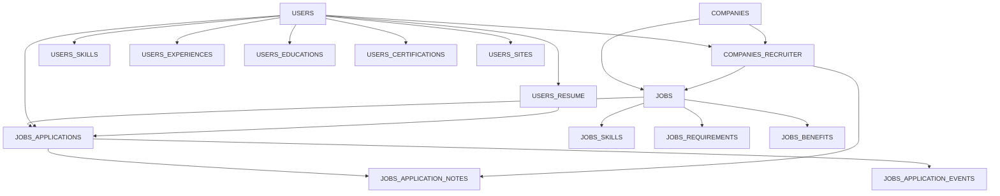

# Design Database - Hiring Platform

Dokumentasi komprehensif design database untuk platform hiring dengan Entity Relationship Diagram (ERD), struktur tabel, relasi, dan penjelasan detail setiap entitas. Database dirancang untuk mendukung system recruitment yang mencakup manajemen user, company, job posting, dan application tracking menggunakan MySQL dengan TypeORM.

## Daftar Isi

- [ERD Overview](#erd-overview)
- [Core Entities](#core-entities)
- [User Profile Entities](#user-profile-entities)
- [Job Management Entities](#job-management-entities)
- [Application Tracking Entities](#application-tracking-entities)
- [Relasi dan Foreign Keys](#relasi-dan-foreign-keys)
- [Indexes dan Constraints](#indexes-dan-constraints)
- [Data Types dan Validations](#data-types-dan-validations)
- [Soft Delete Strategy](#soft-delete-strategy)
- [Performance Considerations](#performance-considerations)

## ERD Overview

```mermaid
erDiagram
    USERS {
        bigint id PK "Auto Increment"
        varchar first_name "NOT NULL, 255 chars"
        varchar last_name "NULL, 255 chars"
        text avatar_path "NULL, S3 object key"
        varchar email "UNIQUE, NOT NULL, 320 chars"
        varchar password "NOT NULL, 500 chars, hashed"
        boolean is_active "DEFAULT true"
        timestamp created_at "AUTO"
        timestamp updated_at "AUTO"
        timestamp deleted_at "NULL, soft delete"
    }

    COMPANIES {
        bigint id PK "Auto Increment"
        varchar name "UNIQUE, NOT NULL, 255 chars"
        varchar website "UNIQUE, NULL, 255 chars"
        text logo_path "NULL, S3 object key"
        text description "NULL"
        timestamp created_at "AUTO"
        timestamp updated_at "AUTO"
        timestamp deleted_at "NULL, soft delete"
    }

    COMPANIES_RECRUITER {
        bigint id PK "Auto Increment"
        bigint company_id FK "NOT NULL"
        bigint recruiter_id FK "NOT NULL"
        enum recuiter_level "owner|manager"
        boolean is_active "DEFAULT true"
        timestamp created_at "AUTO"
        timestamp updated_at "AUTO"
        timestamp deleted_at "NULL, soft delete"
    }

    JOBS {
        bigint id PK "Auto Increment"
        bigint company_id FK "NOT NULL"
        bigint recruiter_id FK "NULL"
        varchar title "NOT NULL, 255 chars"
        varchar slug "UNIQUE, NOT NULL, 255 chars"
        text description "NOT NULL"
        enum employment_type "DEFAULT full-time"
        enum work_location_type "DEFAULT on-site"
        decimal salary_min "NULL, 12,2"
        decimal salary_max "NULL, 12,2"
        enum salary_currency "NULL, ISO codes"
        boolean is_published "DEFAULT false"
        timestamp created_at "AUTO"
        timestamp updated_at "AUTO"
        timestamp deleted_at "NULL, soft delete"
    }

    JOBS_SKILLS {
        bigint id PK "Auto Increment"
        bigint job_id FK "NOT NULL"
        varchar skill_name "NOT NULL, 100 chars"
        enum priority "core|nice_to_have, DEFAULT core"
        enum proficiency "beginner|intermediate|advanced|expert, NULL"
        timestamp created_at "AUTO"
        timestamp updated_at "AUTO"
        timestamp deleted_at "NULL, soft delete"
    }

    JOBS_REQUIREMENTS {
        bigint id PK "Auto Increment"
        bigint job_id FK "NOT NULL"
        varchar label "NOT NULL, 255 chars"
        text detail "NULL"
        timestamp created_at "AUTO"
        timestamp updated_at "AUTO"
        timestamp deleted_at "NULL, soft delete"
    }

    JOBS_BENEFITS {
        bigint id PK "Auto Increment"
        bigint job_id FK "NOT NULL"
        varchar label "NOT NULL, 255 chars"
        text description "NULL"
        timestamp created_at "AUTO"
        timestamp updated_at "AUTO"
        timestamp deleted_at "NULL, soft delete"
    }

    JOBS_APPLICATIONS {
        bigint id PK "Auto Increment"
        bigint job_id FK "NOT NULL"
        bigint candidate_id FK "NOT NULL"
        bigint resume_id FK "NULL"
        text cover_letter "NULL"
        enum status "DEFAULT applied"
        decimal expected_salary "NULL, 12,2"
        enum salary_currency "NULL, ISO codes"
        date available_from "NULL"
        timestamp submitted_at "DEFAULT CURRENT_TIMESTAMP"
        timestamp created_at "AUTO"
        timestamp updated_at "AUTO"
        timestamp deleted_at "NULL, soft delete"
    }

    JOBS_APPLICATION_NOTES {
        bigint id PK "Auto Increment"
        bigint application_id FK "NOT NULL"
        bigint author_recruiter_id FK "NOT NULL"
        text note "NOT NULL"
        timestamp created_at "AUTO"
        timestamp updated_at "AUTO"
        timestamp deleted_at "NULL, soft delete"
    }

    JOBS_APPLICATION_EVENTS {
        bigint id PK "Auto Increment"
        bigint application_id FK "NOT NULL"
        enum status "Application status enum"
        text note "NULL"
        timestamp occurred_at "DEFAULT CURRENT_TIMESTAMP"
        timestamp created_at "AUTO"
        timestamp updated_at "AUTO"
        timestamp deleted_at "NULL, soft delete"
    }

    USERS_SKILLS {
        bigint id PK "Auto Increment"
        bigint user_id FK "NOT NULL"
        varchar skill_name "NOT NULL, 100 chars"
        enum proficiency "beginner|intermediate|advanced|expert"
        smallint years_experience "UNSIGNED, NULL"
        timestamp created_at "AUTO"
        timestamp updated_at "AUTO"
        timestamp deleted_at "NULL, soft delete"
    }

    USERS_EXPERIENCES {
        bigint id PK "Auto Increment"
        bigint user_id FK "NOT NULL"
        varchar title "NOT NULL, 255 chars"
        varchar company "NOT NULL, 255 chars"
        enum type "DEFAULT full-time"
        enum location "DEFAULT on-site"
        enum from_month "01-12, NULL"
        int from_year "UNSIGNED, NULL"
        enum to_month "01-12, NULL"
        int to_year "UNSIGNED, NULL"
        text description "NULL"
        timestamp created_at "AUTO"
        timestamp updated_at "AUTO"
        timestamp deleted_at "NULL, soft delete"
    }

    USERS_EDUCATIONS {
        bigint id PK "Auto Increment"
        bigint user_id FK "NOT NULL"
        varchar institution "NOT NULL, 255 chars"
        enum education_level "9 education levels"
        enum from_month "01-12, NULL"
        int from_year "UNSIGNED, NOT NULL"
        enum to_month "01-12, NULL"
        int to_year "UNSIGNED, NOT NULL"
        text description "NULL"
        timestamp created_at "AUTO"
        timestamp updated_at "AUTO"
        timestamp deleted_at "NULL, soft delete"
    }

    USERS_CERTIFICATIONS {
        bigint id PK "Auto Increment"
        bigint user_id FK "NOT NULL"
        varchar certification_name "NOT NULL, 255 chars"
        varchar issuing_organization "NOT NULL, 255 chars"
        enum issued_month "01-12, NULL"
        int issued_year "UNSIGNED, NOT NULL"
        enum expired_month "01-12, NULL"
        int expired_year "UNSIGNED, NULL"
        varchar certification_id "NULL, 255 chars"
        text certification_url "NULL"
        text certificate_path "NULL, S3 object key"
        timestamp created_at "AUTO"
        timestamp updated_at "AUTO"
        timestamp deleted_at "NULL, soft delete"
    }

    USERS_SITES {
        bigint id PK "Auto Increment"
        bigint user_id FK "NOT NULL"
        enum site_type "LinkedIn|GitHub|Portfolio"
        text url "NOT NULL"
        timestamp created_at "AUTO"
        timestamp updated_at "AUTO"
        timestamp deleted_at "NULL, soft delete"
    }

    USERS_RESUME {
        bigint id PK "Auto Increment"
        bigint user_id FK "NOT NULL"
        text resume_path "NOT NULL, S3 object key"
        timestamp created_at "AUTO"
        timestamp updated_at "AUTO"
        timestamp deleted_at "NULL, soft delete"
    }

    %% Core Relationships
    COMPANIES ||--o{ COMPANIES_RECRUITER : "has recruiters"
    USERS ||--o{ COMPANIES_RECRUITER : "works as recruiter"
    COMPANIES ||--o{ JOBS : "posts jobs"
    COMPANIES_RECRUITER ||--o{ JOBS : "creates job posting"

    %% Job Related Relationships
    JOBS ||--o{ JOBS_SKILLS : "requires skills"
    JOBS ||--o{ JOBS_REQUIREMENTS : "has requirements"
    JOBS ||--o{ JOBS_BENEFITS : "offers benefits"
    JOBS ||--o{ JOBS_APPLICATIONS : "receives applications"

    %% Application Tracking
    USERS ||--o{ JOBS_APPLICATIONS : "applies to jobs"
    USERS_RESUME ||--o{ JOBS_APPLICATIONS : "attached to application"
    JOBS_APPLICATIONS ||--o{ JOBS_APPLICATION_NOTES : "has notes"
    JOBS_APPLICATIONS ||--o{ JOBS_APPLICATION_EVENTS : "tracks status changes"
    COMPANIES_RECRUITER ||--o{ JOBS_APPLICATION_NOTES : "writes notes"

    %% User Profile Relationships
    USERS ||--o{ USERS_SKILLS : "has skills"
    USERS ||--o{ USERS_EXPERIENCES : "has work experience"
    USERS ||--o{ USERS_EDUCATIONS : "has education"
    USERS ||--o{ USERS_CERTIFICATIONS : "has certifications"
    USERS ||--o{ USERS_SITES : "has social/portfolio sites"
    USERS ||--o{ USERS_RESUME : "uploads resumes"
```



## Core Entities

### USERS Table

**Tujuan**: Central user entity untuk candidates dan recruiters
**Storage Engine**: InnoDB dengan AUTO_INCREMENT

| Column        | Type         | Constraints                    | Description                         |
| ------------- | ------------ | ------------------------------ | ----------------------------------- |
| `id`          | BIGINT       | PRIMARY KEY, AUTO_INCREMENT    | Unique identifier                   |
| `first_name`  | VARCHAR(255) | NOT NULL                       | Required first name                 |
| `last_name`   | VARCHAR(255) | NULL                           | Optional last name                  |
| `avatar_path` | TEXT         | NULL                           | S3 object key untuk profile picture |
| `email`       | VARCHAR(320) | UNIQUE, NOT NULL               | RFC 5321 compliant email length     |
| `password`    | VARCHAR(500) | NOT NULL                       | Hashed dengan email salt            |
| `is_active`   | BOOLEAN      | DEFAULT TRUE                   | Account activation status           |
| `created_at`  | TIMESTAMP(6) | DEFAULT CURRENT_TIMESTAMP(6)   | Record creation timestamp           |
| `updated_at`  | TIMESTAMP(6) | ON UPDATE CURRENT_TIMESTAMP(6) | Last modification timestamp         |
| `deleted_at`  | TIMESTAMP(6) | NULL                           | Soft delete timestamp               |

**Indexes**:

- `UNIQUE INDEX IDX_email` pada `email` untuk fast lookup dan uniqueness
- Implicit index pada `id` (PRIMARY KEY)

**Business Logic**:

- Password hashing menggunakan email sebagai salt: `hash(email + password)`
- Soft delete via `deleted_at` timestamp
- Email validation pada application level
- Password comparison method dalam entity

### COMPANIES Table

**Tujuan**: Company information untuk employer accounts
**Storage Engine**: InnoDB dengan AUTO_INCREMENT

| Column        | Type         | Constraints                    | Description                       |
| ------------- | ------------ | ------------------------------ | --------------------------------- |
| `id`          | BIGINT       | PRIMARY KEY, AUTO_INCREMENT    | Unique identifier                 |
| `name`        | VARCHAR(255) | UNIQUE, NOT NULL               | Company name, must be unique      |
| `website`     | VARCHAR(255) | UNIQUE, NULL                   | Company website URL               |
| `logo_path`   | TEXT         | NULL                           | S3 object key untuk company logo  |
| `description` | TEXT         | NULL                           | Company description/about section |
| `created_at`  | TIMESTAMP(6) | DEFAULT CURRENT_TIMESTAMP(6)   | Record creation timestamp         |
| `updated_at`  | TIMESTAMP(6) | ON UPDATE CURRENT_TIMESTAMP(6) | Last modification timestamp       |
| `deleted_at`  | TIMESTAMP(6) | NULL                           | Soft delete timestamp             |

**Indexes**:

- `UNIQUE INDEX IDX_name` pada `name`
- `UNIQUE INDEX IDX_website` pada `website`

**Business Logic**:

- Company name uniqueness enforced at database level
- Website URL validation pada application level
- Logo stored dalam S3 dengan path reference

### COMPANIES_RECRUITER Table

**Tujuan**: Many-to-Many relationship between companies dan users sebagai recruiters
**Storage Engine**: InnoDB dengan AUTO_INCREMENT

| Column           | Type         | Constraints                    | Description                 |
| ---------------- | ------------ | ------------------------------ | --------------------------- |
| `id`             | BIGINT       | PRIMARY KEY, AUTO_INCREMENT    | Unique identifier           |
| `company_id`     | BIGINT       | NOT NULL, FK → companies.id    | Company reference           |
| `recruiter_id`   | BIGINT       | NOT NULL, FK → users.id        | User acting as recruiter    |
| `recuiter_level` | ENUM         | NOT NULL                       | 'owner' atau 'manager'      |
| `is_active`      | BOOLEAN      | DEFAULT TRUE                   | Recruiter activation status |
| `created_at`     | TIMESTAMP(6) | DEFAULT CURRENT_TIMESTAMP(6)   | Record creation timestamp   |
| `updated_at`     | TIMESTAMP(6) | ON UPDATE CURRENT_TIMESTAMP(6) | Last modification timestamp |
| `deleted_at`     | TIMESTAMP(6) | NULL                           | Soft delete timestamp       |

**Enum Values**:

- `recuiter_level`: `'owner'`, `'manager'`

**Foreign Keys**:

- `FK_company_id` → `companies(id)` ON DELETE NO ACTION
- `FK_recruiter_id` → `users(id)` ON DELETE NO ACTION

## User Profile Entities

### USERS_SKILLS Table

**Tujuan**: User's technical dan professional skills dengan proficiency levels
**Storage Engine**: InnoDB dengan AUTO_INCREMENT

| Column             | Type              | Constraints                    | Description                                           |
| ------------------ | ----------------- | ------------------------------ | ----------------------------------------------------- |
| `id`               | BIGINT            | PRIMARY KEY, AUTO_INCREMENT    | Unique identifier                                     |
| `user_id`          | BIGINT            | NOT NULL, FK → users.id        | User reference                                        |
| `skill_name`       | VARCHAR(100)      | NOT NULL                       | Skill name (e.g., "JavaScript", "Project Management") |
| `proficiency`      | ENUM              | NOT NULL                       | Skill level assessment                                |
| `years_experience` | SMALLINT UNSIGNED | NULL                           | Years of experience dengan skill                      |
| `created_at`       | TIMESTAMP(6)      | DEFAULT CURRENT_TIMESTAMP(6)   | Record creation timestamp                             |
| `updated_at`       | TIMESTAMP(6)      | ON UPDATE CURRENT_TIMESTAMP(6) | Last modification timestamp                           |
| `deleted_at`       | TIMESTAMP(6)      | NULL                           | Soft delete timestamp                                 |

**Enum Values**:

- `proficiency`: `'beginner'`, `'intermediate'`, `'advanced'`, `'expert'`

**Foreign Keys**:

- `FK_user_id` → `users(id)` ON DELETE NO ACTION

### USERS_EXPERIENCES Table

**Tujuan**: Work experience history untuk career background
**Storage Engine**: InnoDB dengan AUTO_INCREMENT

| Column        | Type         | Constraints                    | Description                          |
| ------------- | ------------ | ------------------------------ | ------------------------------------ |
| `id`          | BIGINT       | PRIMARY KEY, AUTO_INCREMENT    | Unique identifier                    |
| `user_id`     | BIGINT       | NOT NULL, FK → users.id        | User reference                       |
| `title`       | VARCHAR(255) | NOT NULL                       | Job title/position                   |
| `company`     | VARCHAR(255) | NOT NULL                       | Company name                         |
| `type`        | ENUM         | DEFAULT 'full-time'            | Employment type                      |
| `location`    | ENUM         | DEFAULT 'on-site'              | Work location type                   |
| `from_month`  | ENUM         | NULL                           | Start month (01-12)                  |
| `from_year`   | INT UNSIGNED | NULL                           | Start year                           |
| `to_month`    | ENUM         | NULL                           | End month (01-12), NULL if current   |
| `to_year`     | INT UNSIGNED | NULL                           | End year, NULL if current            |
| `description` | TEXT         | NULL                           | Job description dan responsibilities |
| `created_at`  | TIMESTAMP(6) | DEFAULT CURRENT_TIMESTAMP(6)   | Record creation timestamp            |
| `updated_at`  | TIMESTAMP(6) | ON UPDATE CURRENT_TIMESTAMP(6) | Last modification timestamp          |
| `deleted_at`  | TIMESTAMP(6) | NULL                           | Soft delete timestamp                |

**Enum Values**:

- `type`: `'full-time'`, `'part-time'`, `'freelance'`, `'self-employed'`, `'contract'`, `'temporary'`, `'intern'`
- `location`: `'remote'`, `'on-site'`, `'hybrid'`
- `from_month`, `to_month`: `'01'` hingga `'12'`

### USERS_EDUCATIONS Table

**Tujuan**: Educational background dan qualifications
**Storage Engine**: InnoDB dengan AUTO_INCREMENT

| Column            | Type         | Constraints                    | Description                          |
| ----------------- | ------------ | ------------------------------ | ------------------------------------ |
| `id`              | BIGINT       | PRIMARY KEY, AUTO_INCREMENT    | Unique identifier                    |
| `user_id`         | BIGINT       | NOT NULL, FK → users.id        | User reference                       |
| `institution`     | VARCHAR(255) | NOT NULL                       | Educational institution name         |
| `education_level` | ENUM         | NOT NULL                       | Degree/qualification level           |
| `from_month`      | ENUM         | NULL                           | Start month (01-12)                  |
| `from_year`       | INT UNSIGNED | NOT NULL                       | Start year, required                 |
| `to_month`        | ENUM         | NULL                           | End month (01-12)                    |
| `to_year`         | INT UNSIGNED | NOT NULL                       | End year, required                   |
| `description`     | TEXT         | NULL                           | Additional details, major, GPA, etc. |
| `created_at`      | TIMESTAMP(6) | DEFAULT CURRENT_TIMESTAMP(6)   | Record creation timestamp            |
| `updated_at`      | TIMESTAMP(6) | ON UPDATE CURRENT_TIMESTAMP(6) | Last modification timestamp          |
| `deleted_at`      | TIMESTAMP(6) | NULL                           | Soft delete timestamp                |

**Enum Values**:

- `education_level`: `'High School Diploma or Equivalent'`, `'Vocational Diploma'`, `'Associate's Degree'`, `'Bachelor's Degree'`, `'Postgraduate Diploma'`, `'Master's Degree'`, `'Professional Degree'`, `'Doctoral Degree'`, `'Postdoctoral Research'`

### USERS_CERTIFICATIONS Table

**Tujuan**: Professional certifications dan credentials
**Storage Engine**: InnoDB dengan AUTO_INCREMENT

| Column                 | Type         | Constraints                    | Description                          |
| ---------------------- | ------------ | ------------------------------ | ------------------------------------ |
| `id`                   | BIGINT       | PRIMARY KEY, AUTO_INCREMENT    | Unique identifier                    |
| `user_id`              | BIGINT       | NOT NULL, FK → users.id        | User reference                       |
| `certification_name`   | VARCHAR(255) | NOT NULL                       | Certification title                  |
| `issuing_organization` | VARCHAR(255) | NOT NULL                       | Organization yang issued certificate |
| `issued_month`         | ENUM         | NULL                           | Issue month (01-12)                  |
| `issued_year`          | INT UNSIGNED | NOT NULL                       | Issue year, required                 |
| `expired_month`        | ENUM         | NULL                           | Expiration month (01-12)             |
| `expired_year`         | INT UNSIGNED | NULL                           | Expiration year, NULL if permanent   |
| `certification_id`     | VARCHAR(255) | NULL                           | Certificate ID/credential number     |
| `certification_url`    | TEXT         | NULL                           | Verification URL                     |
| `certificate_path`     | TEXT         | NULL                           | S3 object key untuk certificate file |
| `created_at`           | TIMESTAMP(6) | DEFAULT CURRENT_TIMESTAMP(6)   | Record creation timestamp            |
| `updated_at`           | TIMESTAMP(6) | ON UPDATE CURRENT_TIMESTAMP(6) | Last modification timestamp          |
| `deleted_at`           | TIMESTAMP(6) | NULL                           | Soft delete timestamp                |

### USERS_SITES Table

**Tujuan**: Social media dan portfolio links
**Storage Engine**: InnoDB dengan AUTO_INCREMENT

| Column       | Type         | Constraints                    | Description                 |
| ------------ | ------------ | ------------------------------ | --------------------------- |
| `id`         | BIGINT       | PRIMARY KEY, AUTO_INCREMENT    | Unique identifier           |
| `user_id`    | BIGINT       | NOT NULL, FK → users.id        | User reference              |
| `site_type`  | ENUM         | NOT NULL                       | Platform type               |
| `url`        | TEXT         | NOT NULL                       | Profile URL                 |
| `created_at` | TIMESTAMP(6) | DEFAULT CURRENT_TIMESTAMP(6)   | Record creation timestamp   |
| `updated_at` | TIMESTAMP(6) | ON UPDATE CURRENT_TIMESTAMP(6) | Last modification timestamp |
| `deleted_at` | TIMESTAMP(6) | NULL                           | Soft delete timestamp       |

**Enum Values**:

- `site_type`: `'LinkedIn'`, `'GitHub'`, `'Portofolio Website'`

### USERS_RESUME Table

**Tujuan**: Resume file storage references
**Storage Engine**: InnoDB dengan AUTO_INCREMENT

| Column        | Type         | Constraints                    | Description                     |
| ------------- | ------------ | ------------------------------ | ------------------------------- |
| `id`          | BIGINT       | PRIMARY KEY, AUTO_INCREMENT    | Unique identifier               |
| `user_id`     | BIGINT       | NOT NULL, FK → users.id        | User reference                  |
| `resume_path` | TEXT         | NOT NULL                       | S3 object key untuk resume file |
| `created_at`  | TIMESTAMP(6) | DEFAULT CURRENT_TIMESTAMP(6)   | Record creation timestamp       |
| `updated_at`  | TIMESTAMP(6) | ON UPDATE CURRENT_TIMESTAMP(6) | Last modification timestamp     |
| `deleted_at`  | TIMESTAMP(6) | NULL                           | Soft delete timestamp           |

## Job Management Entities

### JOBS Table

**Tujuan**: Job posting information dengan salary dan requirements
**Storage Engine**: InnoDB dengan AUTO_INCREMENT

| Column               | Type          | Constraints                       | Description                    |
| -------------------- | ------------- | --------------------------------- | ------------------------------ |
| `id`                 | BIGINT        | PRIMARY KEY, AUTO_INCREMENT       | Unique identifier              |
| `company_id`         | BIGINT        | NOT NULL, FK → companies.id       | Company posting the job        |
| `recruiter_id`       | BIGINT        | NULL, FK → companies_recruiter.id | Recruiter who created posting  |
| `title`              | VARCHAR(255)  | NOT NULL                          | Job title                      |
| `slug`               | VARCHAR(255)  | UNIQUE, NOT NULL                  | URL-friendly identifier        |
| `description`        | TEXT          | NOT NULL                          | Detailed job description       |
| `employment_type`    | ENUM          | DEFAULT 'full-time'               | Employment type                |
| `work_location_type` | ENUM          | DEFAULT 'on-site'                 | Work location arrangement      |
| `salary_min`         | DECIMAL(12,2) | NULL                              | Minimum salary offer           |
| `salary_max`         | DECIMAL(12,2) | NULL                              | Maximum salary offer           |
| `salary_currency`    | ENUM          | NULL                              | Currency code (180+ ISO codes) |
| `is_published`       | BOOLEAN       | DEFAULT FALSE                     | Publication status             |
| `created_at`         | TIMESTAMP(6)  | DEFAULT CURRENT_TIMESTAMP(6)      | Record creation timestamp      |
| `updated_at`         | TIMESTAMP(6)  | ON UPDATE CURRENT_TIMESTAMP(6)    | Last modification timestamp    |
| `deleted_at`         | TIMESTAMP(6)  | NULL                              | Soft delete timestamp          |

**Indexes**:

- `UNIQUE INDEX IDX_slug` pada `slug` untuk SEO-friendly URLs

**Foreign Keys**:

- `FK_company_id` → `companies(id)` ON DELETE NO ACTION
- `FK_recruiter_id` → `companies_recruiter(id)` ON DELETE NO ACTION

**Enum Values**:

- `employment_type`: Same as user experiences
- `work_location_type`: Same as user experiences
- `salary_currency`: 180+ ISO currency codes (AED, USD, EUR, etc.)

### JOBS_SKILLS Table

**Tujuan**: Required skills untuk specific job posting
**Storage Engine**: InnoDB dengan AUTO_INCREMENT

| Column        | Type         | Constraints                    | Description                 |
| ------------- | ------------ | ------------------------------ | --------------------------- |
| `id`          | BIGINT       | PRIMARY KEY, AUTO_INCREMENT    | Unique identifier           |
| `job_id`      | BIGINT       | NOT NULL, FK → jobs.id         | Job posting reference       |
| `skill_name`  | VARCHAR(100) | NOT NULL                       | Required skill name         |
| `priority`    | ENUM         | DEFAULT 'core'                 | Skill priority level        |
| `proficiency` | ENUM         | NULL                           | Required proficiency level  |
| `created_at`  | TIMESTAMP(6) | DEFAULT CURRENT_TIMESTAMP(6)   | Record creation timestamp   |
| `updated_at`  | TIMESTAMP(6) | ON UPDATE CURRENT_TIMESTAMP(6) | Last modification timestamp |
| `deleted_at`  | TIMESTAMP(6) | NULL                           | Soft delete timestamp       |

**Enum Values**:

- `priority`: `'core'`, `'nice to have'`
- `proficiency`: `'beginner'`, `'intermediate'`, `'advanced'`, `'expert'`

### JOBS_REQUIREMENTS Table

**Tujuan**: Structured job requirements beyond skills
**Storage Engine**: InnoDB dengan AUTO_INCREMENT

| Column       | Type         | Constraints                    | Description                      |
| ------------ | ------------ | ------------------------------ | -------------------------------- |
| `id`         | BIGINT       | PRIMARY KEY, AUTO_INCREMENT    | Unique identifier                |
| `job_id`     | BIGINT       | NOT NULL, FK → jobs.id         | Job posting reference            |
| `label`      | VARCHAR(255) | NOT NULL                       | Requirement category/title       |
| `detail`     | TEXT         | NULL                           | Detailed requirement description |
| `created_at` | TIMESTAMP(6) | DEFAULT CURRENT_TIMESTAMP(6)   | Record creation timestamp        |
| `updated_at` | TIMESTAMP(6) | ON UPDATE CURRENT_TIMESTAMP(6) | Last modification timestamp      |
| `deleted_at` | TIMESTAMP(6) | NULL                           | Soft delete timestamp            |

### JOBS_BENEFITS Table

**Tujuan**: Job benefits dan perks offering
**Storage Engine**: InnoDB dengan AUTO_INCREMENT

| Column        | Type         | Constraints                    | Description                  |
| ------------- | ------------ | ------------------------------ | ---------------------------- |
| `id`          | BIGINT       | PRIMARY KEY, AUTO_INCREMENT    | Unique identifier            |
| `job_id`      | BIGINT       | NOT NULL, FK → jobs.id         | Job posting reference        |
| `label`       | VARCHAR(255) | NOT NULL                       | Benefit category/title       |
| `description` | TEXT         | NULL                           | Detailed benefit description |
| `created_at`  | TIMESTAMP(6) | DEFAULT CURRENT_TIMESTAMP(6)   | Record creation timestamp    |
| `updated_at`  | TIMESTAMP(6) | ON UPDATE CURRENT_TIMESTAMP(6) | Last modification timestamp  |
| `deleted_at`  | TIMESTAMP(6) | NULL                           | Soft delete timestamp        |

## Application Tracking Entities

### JOBS_APPLICATIONS Table

**Tujuan**: Job application submissions dengan status tracking
**Storage Engine**: InnoDB dengan AUTO_INCREMENT

| Column            | Type          | Constraints                    | Description                    |
| ----------------- | ------------- | ------------------------------ | ------------------------------ |
| `id`              | BIGINT        | PRIMARY KEY, AUTO_INCREMENT    | Unique identifier              |
| `job_id`          | BIGINT        | NOT NULL, FK → jobs.id         | Job posting reference          |
| `candidate_id`    | BIGINT        | NOT NULL, FK → users.id        | Applying candidate             |
| `resume_id`       | BIGINT        | NULL, FK → users_resume.id     | Attached resume                |
| `cover_letter`    | TEXT          | NULL                           | Optional cover letter          |
| `status`          | ENUM          | DEFAULT 'applied'              | Application status             |
| `expected_salary` | DECIMAL(12,2) | NULL                           | Candidate's salary expectation |
| `salary_currency` | ENUM          | NULL                           | Currency for expected salary   |
| `available_from`  | DATE          | NULL                           | Candidate availability date    |
| `submitted_at`    | TIMESTAMP     | DEFAULT CURRENT_TIMESTAMP      | Application submission time    |
| `created_at`      | TIMESTAMP(6)  | DEFAULT CURRENT_TIMESTAMP(6)   | Record creation timestamp      |
| `updated_at`      | TIMESTAMP(6)  | ON UPDATE CURRENT_TIMESTAMP(6) | Last modification timestamp    |
| `deleted_at`      | TIMESTAMP(6)  | NULL                           | Soft delete timestamp          |

**Enum Values**:

- `status`: `'applied'`, `'under review'`, `'interview'`, `'offer'`, `'hired'`, `'rejected'`, `'withdrawn'`

**Foreign Keys**:

- `FK_job_id` → `jobs(id)` ON DELETE NO ACTION
- `FK_candidate_id` → `users(id)` ON DELETE NO ACTION
- `FK_resume_id` → `users_resume(id)` ON DELETE NO ACTION

### JOBS_APPLICATION_NOTES Table

**Tujuan**: Recruiter notes pada applications untuk evaluation tracking
**Storage Engine**: InnoDB dengan AUTO_INCREMENT

| Column                | Type         | Constraints                           | Description                 |
| --------------------- | ------------ | ------------------------------------- | --------------------------- |
| `id`                  | BIGINT       | PRIMARY KEY, AUTO_INCREMENT           | Unique identifier           |
| `application_id`      | BIGINT       | NOT NULL, FK → jobs_applications.id   | Application reference       |
| `author_recruiter_id` | BIGINT       | NOT NULL, FK → companies_recruiter.id | Note author                 |
| `note`                | TEXT         | NOT NULL                              | Recruiter evaluation note   |
| `created_at`          | TIMESTAMP(6) | DEFAULT CURRENT_TIMESTAMP(6)          | Record creation timestamp   |
| `updated_at`          | TIMESTAMP(6) | ON UPDATE CURRENT_TIMESTAMP(6)        | Last modification timestamp |
| `deleted_at`          | TIMESTAMP(6) | NULL                                  | Soft delete timestamp       |

**Foreign Keys**:

- `FK_application_id` → `jobs_applications(id)` ON DELETE NO ACTION
- `FK_author_recruiter_id` → `companies_recruiter(id)` ON DELETE NO ACTION

### JOBS_APPLICATION_EVENTS Table

**Tujuan**: Audit trail untuk application status changes
**Storage Engine**: InnoDB dengan AUTO_INCREMENT

| Column           | Type         | Constraints                         | Description                 |
| ---------------- | ------------ | ----------------------------------- | --------------------------- |
| `id`             | BIGINT       | PRIMARY KEY, AUTO_INCREMENT         | Unique identifier           |
| `application_id` | BIGINT       | NOT NULL, FK → jobs_applications.id | Application reference       |
| `status`         | ENUM         | NOT NULL                            | Status change value         |
| `note`           | TEXT         | NULL                                | Optional change reason/note |
| `occurred_at`    | TIMESTAMP    | DEFAULT CURRENT_TIMESTAMP           | When status changed         |
| `created_at`     | TIMESTAMP(6) | DEFAULT CURRENT_TIMESTAMP(6)        | Record creation timestamp   |
| `updated_at`     | TIMESTAMP(6) | ON UPDATE CURRENT_TIMESTAMP(6)      | Last modification timestamp |
| `deleted_at`     | TIMESTAMP(6) | NULL                                | Soft delete timestamp       |

**Enum Values**:

- `status`: Same as jobs_applications.status

**Foreign Keys**:

- `FK_application_id` → `jobs_applications(id)` ON DELETE NO ACTION

## Relasi dan Foreign Keys

### Core Business Relationships



### Foreign Key Constraints

Semua foreign keys menggunakan `ON DELETE NO ACTION ON UPDATE NO ACTION` untuk:

- **Data Integrity**: Mencegah cascading deletes yang tidak diinginkan
- **Audit Trail**: Preserving references untuk historical data
- **Business Logic**: Application-level handling of deletions

## Indexes dan Constraints

### Primary Indexes

- Semua tables menggunakan `BIGINT AUTO_INCREMENT` primary keys
- Primary keys automatically indexed oleh InnoDB

### Unique Constraints

- `users.email` - Prevent duplicate email registrations
- `companies.name` - Unique company names
- `companies.website` - Unique company websites
- `jobs.slug` - SEO-friendly unique URLs

### Composite Indexes (Recommended)

```sql
-- Application lookup by job and candidate
CREATE INDEX IDX_jobs_applications_job_candidate
ON jobs_applications(job_id, candidate_id);

-- User profile data queries
CREATE INDEX IDX_users_skills_user_proficiency
ON users_skills(user_id, proficiency);

-- Job search and filtering
CREATE INDEX IDX_jobs_company_published
ON jobs(company_id, is_published, created_at);

-- Application status tracking
CREATE INDEX IDX_jobs_applications_status_submitted
ON jobs_applications(status, submitted_at);
```

## Data Types dan Validations

### String Fields

- **VARCHAR** untuk fixed-length strings dengan specific limits
- **TEXT** untuk variable-length content (descriptions, notes, URLs)
- **Email**: VARCHAR(320) untuk RFC 5321 compliance
- **Names**: VARCHAR(255) untuk reasonable length limits

### Numeric Fields

- **BIGINT**: Primary keys dan foreign keys untuk large scale
- **DECIMAL(12,2)**: Salary values dengan 2 decimal precision
- **SMALLINT UNSIGNED**: Years of experience (0-65535 range)
- **INT UNSIGNED**: Year values (supports up to year 4294967295)

### Enum Fields

- **Consistent values** across related tables (job types, locations)
- **Extensible design** untuk future enum value additions
- **Default values** untuk required enums

### Date/Time Fields

- **TIMESTAMP(6)**: Microsecond precision untuk audit trails
- **DATE**: Simple date values tanpa time component
- **Automatic timestamps**: created_at, updated_at dengan triggers

## Soft Delete Strategy

### Implementation

- `deleted_at TIMESTAMP(6) NULL` pada all tables
- **NULL** = active record
- **Timestamp** = soft deleted record

### Benefits

- **Data Recovery**: Accidental deletions dapat di-restore
- **Audit Compliance**: Historical data preserved
- **Referential Integrity**: Foreign key references remain valid
- **Analytics**: Deleted data available untuk historical analysis

### Query Patterns

```sql
-- Active records only
SELECT * FROM users WHERE deleted_at IS NULL;

-- Include soft deleted
SELECT * FROM users WHERE deleted_at IS NULL OR deleted_at > '2024-01-01';

-- Restore soft deleted
UPDATE users SET deleted_at = NULL WHERE id = ?;
```

## Performance Considerations

### Indexing Strategy

1. **Primary Keys**: Auto-indexed, optimal untuk joins
2. **Foreign Keys**: Index all FK columns untuk join performance
3. **Unique Constraints**: Business rule enforcement with fast lookups
4. **Composite Indexes**: Multi-column queries pada filtered results
5. **Covering Indexes**: Include frequently selected columns

### Query Optimization

1. **Soft Delete Filtering**: Always include `deleted_at IS NULL` dalam WHERE clauses
2. **Pagination**: Use LIMIT/OFFSET dengan proper ORDER BY
3. **Join Optimization**: Select only required columns, avoid SELECT \*
4. **Enum Indexing**: Enums are internally indexed sebagai integers

### Storage Optimization

1. **InnoDB Engine**: ACID compliance, row-level locking
2. **BIGINT PKs**: Future-proof untuk high-volume applications
3. **TEXT vs VARCHAR**: Appropriate sizing untuk content types
4. **Timestamp Precision**: TIMESTAMP(6) untuk high-precision auditing

### Scaling Considerations

1. **Read Replicas**: Separate read queries dari write operations
2. **Partitioning**: Consider date-based partitioning untuk large tables
3. **Archiving**: Move old application data to archive tables
4. **Connection Pooling**: Optimize database connection management
