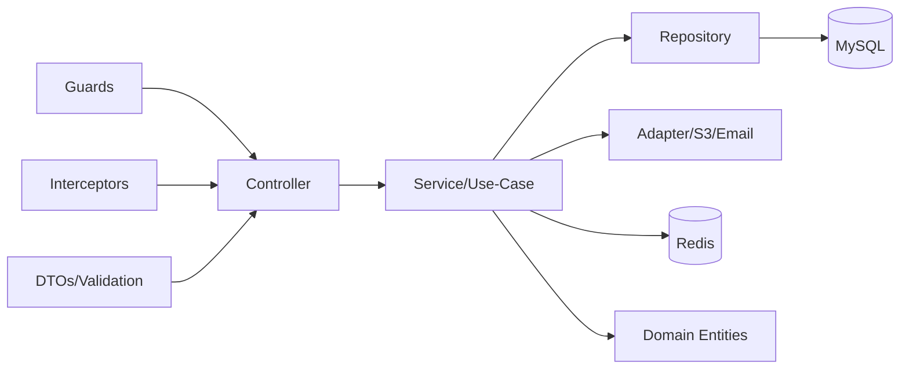
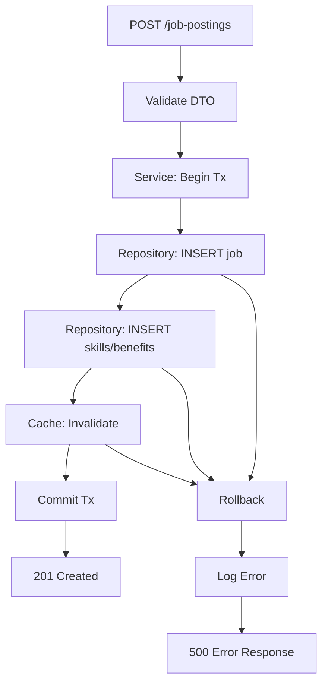
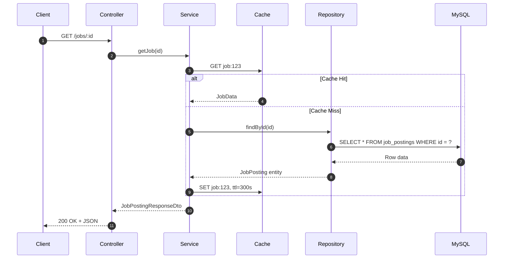

# Design Pattern NestJS

Dokumentasi pola desain yang diimplementasikan dalam platform hiring backend. Menjelaskan pemilihan pattern berdasarkan trade-off, implementasi konkret, dan posisi dalam arsitektur untuk memastikan maintainability, testability, dan scalability menggunakan Node.js 20, NestJS, Express, TypeORM, MySQL, Redis, dan NestJS Logger.

## Daftar Isi

- [Peta Arsitektur & Boundary](#peta-arsitektur--boundary)
- [Pola Inti](#pola-inti)
- [Pola Pendukung](#pola-pendukung)
- [Diagram Aliran Pola](#diagram-aliran-pola)
- [Contoh Kode Minimal](#contoh-kode-minimal)
- [Trade-off & Alternatif](#trade-off--alternatif)
- [Checklist Implementasi](#checklist-implementasi)
- [ADR (Architecture Decision Record)](#adr-architecture-decision-record)
- [Referensi Cepat](#referensi-cepat)

## Peta Arsitektur & Boundary

| Komponen          | Layer          | Tanggung Jawab                                     | Ketergantungan             |
| ----------------- | -------------- | -------------------------------------------------- | -------------------------- |
| **Controller**    | Presentation   | Route handling, request/response transformation    | Service Layer              |
| **Service**       | Application    | Use-case orchestration, business logic             | Repository, Cache, Adapter |
| **Repository**    | Infrastructure | Data access abstraction, query optimization        | TypeORM, MySQL             |
| **Entity**        | Domain         | Business rules, invariants, behavior encapsulation | None (pure domain)         |
| **DTO**           | Interface      | Data contract, validation, serialization           | class-validator            |
| **Guard**         | Infrastructure | Authentication, authorization, rate limiting       | JWT, Database              |
| **Interceptor**   | Infrastructure | Cross-cutting concerns, response transformation    | Cache, Logger              |
| **Adapter**       | Infrastructure | External service integration                       | S3, SMTP, Third-party APIs |
| **Cache Service** | Infrastructure | Cache-aside pattern, invalidation strategy         | Redis                      |



## Pola Inti

### Repository Pattern

**Tujuan**: Abstraksi akses data untuk memisahkan domain logic dari persistence details.

**Implementasi**: TypeORM repositories dengan dependency injection, transaction support.

```typescript
// Interface domain - tidak tergantung ORM
export interface UserRepository {
  findById(id: string): Promise<User | null>;
  save(user: User): Promise<User>;
  findByEmail(email: string): Promise<User | null>;
}

// Implementasi infrastruktur
@Injectable()
export class TypeOrmUserRepository implements UserRepository {
  constructor(
    @InjectRepository(User)
    private readonly repo: Repository<User>,
  ) {}

  async findById(id: string): Promise<User | null> {
    return this.repo.findOne({ where: { id } });
  }

  async save(user: User): Promise<User> {
    return this.repo.save(user);
  }

  async findByEmail(email: string): Promise<User | null> {
    return this.repo.findOne({ where: { email } });
  }
}
```

### Service Layer / Use-Case

**Tujuan**: Orchestrasi business logic, transaction management, external service coordination.

**Implementasi**: Thin controllers, fat services dengan clear boundaries.

```typescript
@Injectable()
export class UserService {
  constructor(
    private readonly userRepository: Repository<User>,
    private readonly cache: CacheHelperService,
    private readonly bucketService: BucketService,
    @Optional() private readonly dataSource?: DataSource,
  ) {}

  async updateAvatar(userId: string, file: Express.Multer.File): Promise<UserAvatarData> {
    // 1. Validation
    const user = await this.userRepository.findOne({ where: { id: userId } });
    if (!user) throw new NotFoundException('User not found.');

    // 2. Business logic
    const extension = this.resolveExtension(file);
    const key = this.buildAvatarKey(userId, extension);

    // 3. Transaction dengan side effects
    return withTransaction(this.dataSource, async (em?: EntityManager) => {
      // Delete previous avatar
      if (user.avatarPath && user.avatarPath !== key) {
        await this.bucketService.deleteObject(user.avatarPath);
      }

      // Upload new avatar
      await this.bucketService.uploadObject(key, file.buffer, file.mimetype);

      // Update entity
      user.avatarPath = key;
      const repo = em ? em.getRepository(User) : this.userRepository;
      await repo.save(user);

      // Cache invalidation
      await this.cache.del(buildCacheKey('user', 'avatar', userId));
      await this.cache.del(buildHttpCacheKeyForUserPath(userId, '/user/avatar'));

      return { avatarUrl: this.bucketService.getPublicUrl(key) };
    });
  }
}
```

### DTO + Validation

**Tujuan**: Kontrak input/output yang strongly-typed dengan automatic validation.

**Implementasi**: class-validator dengan transformation pipes.

```typescript
// Input contract
export class CreateJobPostingDto {
  @IsString()
  @IsNotEmpty()
  @MaxLength(200)
  title: string;

  @IsString()
  @IsNotEmpty()
  description: string;

  @IsEnum(JobType)
  jobType: JobType;

  @IsNumber()
  @Min(0)
  salaryMin: number;

  @IsNumber()
  @Min(0)
  salaryMax: number;

  @IsOptional()
  @IsArray()
  @ValidateNested({ each: true })
  @Type(() => CreateJobSkillDto)
  skills?: CreateJobSkillDto[];
}

// Output contract
export class JobPostingResponseDto {
  @Expose()
  id: string;

  @Expose()
  title: string;

  @Expose()
  @Type(() => CompanyResponseDto)
  company: CompanyResponseDto;

  @Expose()
  @Type(() => JobSkillResponseDto)
  skills: JobSkillResponseDto[];
}
```

### Dependency Injection

**Tujuan**: Loose coupling, testability, configuration centralization.

**Implementasi**: NestJS module system dengan provider registration.

```typescript
@Module({
  imports: [TypeOrmModule.forFeature([User, JobPosting, Company]), CacheModule],
  controllers: [UserController],
  providers: [
    UserService,
    // Repository abstraction
    {
      provide: 'UserRepository',
      useClass: TypeOrmUserRepository,
    },
    // Strategy pattern
    {
      provide: 'ScoringStrategy',
      useFactory: (config: ConfigService) => {
        return config.get('SCORING_TYPE') === 'ATS' ? new AtsScoring() : new ManualScoring();
      },
      inject: [ConfigService],
    },
  ],
  exports: [UserService],
})
export class UserModule {}
```

## Pola Pendukung

### Strategy Pattern

**Tujuan**: Algoritma scoring aplikasi yang dapat ditukar (ATS vs Manual).

```typescript
// Abstraksi strategy
export interface ScoringStrategy {
  score(application: JobApplication): Promise<number>;
}

// Implementasi konkret
@Injectable()
export class AtsScoring implements ScoringStrategy {
  async score(application: JobApplication): Promise<number> {
    const skills = application.user.skills || [];
    const jobSkills = application.jobPosting.skills || [];

    const matchCount = skills.filter((userSkill) =>
      jobSkills.some((jobSkill) => jobSkill.name.toLowerCase() === userSkill.name.toLowerCase()),
    ).length;

    return Math.min((matchCount / jobSkills.length) * 100, 100);
  }
}

@Injectable()
export class ManualScoring implements ScoringStrategy {
  async score(application: JobApplication): Promise<number> {
    // Default score untuk manual review
    return 60;
  }
}

// Usage dalam service
@Injectable()
export class ApplicationService {
  constructor(@Inject('ScoringStrategy') private readonly scorer: ScoringStrategy) {}

  async calculateScore(applicationId: string): Promise<number> {
    const application = await this.findApplicationWithRelations(applicationId);
    return this.scorer.score(application);
  }
}
```

### Adapter Pattern

**Tujuan**: Integrasi external services (S3, Email) dengan interface yang konsisten.

```typescript
// Port (domain interface)
export interface StoragePort {
  upload(key: string, data: Buffer, mimeType: string): Promise<string>;
  delete(key: string): Promise<void>;
  getPublicUrl(key: string): string;
}

// Adapter implementasi
@Injectable()
export class S3StorageAdapter implements StoragePort {
  constructor(private readonly s3Client: S3Client) {}

  async upload(key: string, data: Buffer, mimeType: string): Promise<string> {
    await this.s3Client.send(
      new PutObjectCommand({
        Bucket: this.bucketName,
        Key: key,
        Body: data,
        ContentType: mimeType,
      }),
    );
    return key;
  }

  async delete(key: string): Promise<void> {
    await this.s3Client.send(
      new DeleteObjectCommand({
        Bucket: this.bucketName,
        Key: key,
      }),
    );
  }

  getPublicUrl(key: string): string {
    return `https://${this.bucketName}.s3.amazonaws.com/${key}`;
  }
}
```

### Cache-Aside Pattern

**Tujuan**: Performance optimization dengan manual cache management.

```typescript
@Injectable()
export class JobPostingService {
  constructor(
    private readonly jobRepository: Repository<JobPosting>,
    private readonly cache: CacheHelperService,
  ) {}

  async getJobPosting(id: string): Promise<JobPostingData> {
    const cacheKey = buildCacheKey('job', id);

    return this.cache.getOrSet(
      cacheKey,
      async () => {
        const job = await this.jobRepository.findOne({
          where: { id },
          relations: ['company', 'skills', 'requirements', 'benefits'],
        });

        if (!job) {
          throw new NotFoundException('Job posting not found');
        }

        return this.transformToDto(job);
      },
      300_000, // 5 minutes TTL
    );
  }

  async updateJobPosting(id: string, dto: UpdateJobPostingDto): Promise<JobPostingData> {
    return withTransaction(this.dataSource, async (manager) => {
      const job = await manager.findOne(JobPosting, { where: { id } });
      if (!job) throw new NotFoundException('Job posting not found');

      Object.assign(job, dto);
      const updated = await manager.save(job);

      // Cache invalidation strategy
      await this.cache.del(buildCacheKey('job', id));
      await this.cache.invalidateIndex(buildCacheKey('jobs', 'list'));

      return this.transformToDto(updated);
    });
  }
}
```

### Circuit Breaker / Retry Pattern

**Tujuan**: Resilience untuk external service calls.

```typescript
@Injectable()
export class EmailService {
  private readonly circuitBreaker = new Map<
    string,
    {
      failures: number;
      lastFailure: number;
      state: 'CLOSED' | 'OPEN' | 'HALF_OPEN';
    }
  >();

  async sendEmail(to: string, subject: string, body: string): Promise<void> {
    const serviceKey = 'email_service';
    const breaker = this.getCircuitBreaker(serviceKey);

    if (breaker.state === 'OPEN') {
      const timeSinceLastFailure = Date.now() - breaker.lastFailure;
      if (timeSinceLastFailure < 60000) {
        // 1 minute cooldown
        throw new Error('Email service circuit breaker is OPEN');
      }
      breaker.state = 'HALF_OPEN';
    }

    try {
      await this.retryWithBackoff(async () => {
        await this.smtpAdapter.send(to, subject, body);
      });

      // Reset circuit breaker on success
      breaker.failures = 0;
      breaker.state = 'CLOSED';
    } catch (error) {
      breaker.failures++;
      breaker.lastFailure = Date.now();

      if (breaker.failures >= 5) {
        breaker.state = 'OPEN';
      }

      throw error;
    }
  }

  private async retryWithBackoff<T>(
    operation: () => Promise<T>,
    maxRetries: number = 3,
  ): Promise<T> {
    for (let attempt = 1; attempt <= maxRetries; attempt++) {
      try {
        return await operation();
      } catch (error) {
        if (attempt === maxRetries) throw error;

        const delay = Math.min(1000 * Math.pow(2, attempt - 1), 10000);
        await new Promise((resolve) => setTimeout(resolve, delay));
      }
    }
    throw new Error('Max retries exceeded');
  }
}
```

### Idempotency Key Pattern

**Tujuan**: Mencegah duplicate operations pada endpoint tulis.

```typescript
@Injectable()
export class IdempotencyService {
  constructor(private readonly cache: CacheHelperService) {}

  async executeIdempotent<T>(
    key: string,
    operation: () => Promise<T>,
    ttlMs: number = 3600000, // 1 hour
  ): Promise<T> {
    const cacheKey = `idempotency:${key}`;

    // Check if operation already executed
    const cached = await this.cache.get<T>(cacheKey);
    if (cached) {
      return cached;
    }

    // Execute operation and cache result
    const result = await operation();
    await this.cache.set(cacheKey, result, ttlMs);

    return result;
  }
}

// Usage dalam controller
@Post('/applications')
async createApplication(
  @Body() dto: CreateApplicationDto,
  @Headers('idempotency-key') idempotencyKey?: string,
): Promise<ApplicationResponseDto> {
  if (!idempotencyKey) {
    throw new BadRequestException('Idempotency-Key header is required');
  }

  return this.idempotencyService.executeIdempotent(
    idempotencyKey,
    () => this.applicationService.create(dto),
  );
}
```

## Diagram Aliran Pola

### Flow Tulis dengan Transaction



### Sequence Read dengan Cache-Aside



## Contoh Kode Minimal

### Controller Tipis

```typescript
@Controller('jobs')
@UseGuards(JwtAuthGuard)
export class JobPostingController {
  constructor(private readonly jobService: JobPostingService) {}

  @Get(':id')
  @UseInterceptors(CacheInterceptor)
  async getJob(@Param('id') id: string): Promise<JobPostingResponseDto> {
    return this.jobService.getJobPosting(id);
  }

  @Post()
  @HttpCode(201)
  async createJob(
    @Body() dto: CreateJobPostingDto,
    @CurrentUser() user: UserPayload,
  ): Promise<JobPostingResponseDto> {
    return this.jobService.createJobPosting(user.sub, dto);
  }
}
```

### Service dengan Use-Case

```typescript
@Injectable()
export class JobPostingService {
  constructor(
    @InjectRepository(JobPosting)
    private readonly jobRepository: Repository<JobPosting>,
    private readonly cache: CacheHelperService,
    @Optional() private readonly dataSource?: DataSource,
  ) {}

  async createJobPosting(
    recruiterId: string,
    dto: CreateJobPostingDto,
  ): Promise<JobPostingResponseDto> {
    return withTransaction(this.dataSource, async (manager) => {
      // 1. Validate recruiter access
      await this.validateRecruiterAccess(recruiterId, dto.companyId);

      // 2. Create main entity
      const job = manager.create(JobPosting, {
        ...dto,
        companyId: dto.companyId,
        createdBy: recruiterId,
      });
      const savedJob = await manager.save(job);

      // 3. Create related entities
      if (dto.skills?.length) {
        const skills = dto.skills.map((skill) =>
          manager.create(JobSkill, {
            ...skill,
            jobPostingId: savedJob.id,
          }),
        );
        await manager.save(skills);
      }

      // 4. Cache invalidation
      await this.cache.invalidateIndex('jobs:list');

      return this.transformToResponseDto(savedJob);
    });
  }
}
```

### Repository dengan Transaction

```typescript
@Injectable()
export class ApplicationRepository {
  constructor(
    @InjectRepository(JobApplication)
    private readonly repo: Repository<JobApplication>,
  ) {}

  async findWithUserAndJob(id: string): Promise<JobApplication | null> {
    return this.repo.findOne({
      where: { id },
      relations: {
        user: { skills: true, experiences: true },
        jobPosting: { skills: true, company: true },
      },
    });
  }

  async createWithTransaction(
    manager: EntityManager,
    data: Partial<JobApplication>,
  ): Promise<JobApplication> {
    const application = manager.create(JobApplication, data);
    return manager.save(application);
  }
}
```

### Strategy Konkret

```typescript
@Injectable()
export class ExperienceMatchingStrategy implements ScoringStrategy {
  async score(application: JobApplication): Promise<number> {
    const userExp = application.user.experiences || [];
    const requiredExp = application.jobPosting.experienceYears || 0;

    const totalUserExp = userExp.reduce((sum, exp) => {
      const months = this.calculateMonths(exp.startDate, exp.endDate);
      return sum + months;
    }, 0);

    const userYears = totalUserExp / 12;

    if (userYears >= requiredExp) return 100;
    if (userYears >= requiredExp * 0.7) return 80;
    if (userYears >= requiredExp * 0.5) return 60;

    return 40;
  }

  private calculateMonths(start: Date, end: Date | null): number {
    const endDate = end || new Date();
    const diffTime = Math.abs(endDate.getTime() - start.getTime());
    return Math.ceil(diffTime / (1000 * 60 * 60 * 24 * 30));
  }
}
```

### Adapter Eksternal

```typescript
@Injectable()
export class SmtpEmailAdapter implements EmailPort {
  private transporter: nodemailer.Transporter;

  constructor(private readonly config: ConfigService) {
    this.transporter = nodemailer.createTransporter({
      host: config.get('SMTP_HOST'),
      port: config.get('SMTP_PORT'),
      secure: false,
      auth: {
        user: config.get('SMTP_USER'),
        pass: config.get('SMTP_PASS'),
      },
    });
  }

  async send(to: string, subject: string, html: string): Promise<void> {
    await this.transporter.sendMail({
      from: this.config.get('SMTP_FROM'),
      to,
      subject,
      html,
    });
  }
}
```

## Trade-off & Alternatif

| Pola                | Kelebihan                                | Kekurangan                            | Kapan Dipakai                          | Anti-Pattern yang Dihindari        |
| ------------------- | ---------------------------------------- | ------------------------------------- | -------------------------------------- | ---------------------------------- |
| **Repository**      | Testability, domain isolation            | Boilerplate, abstraction overhead     | Complex queries, multiple data sources | Anemic domain, leaky abstraction   |
| **Service Layer**   | Clear boundaries, transaction management | Fat services risk                     | Business logic coordination            | Transaction script, god service    |
| **Strategy**        | Algorithm flexibility, testability       | Runtime overhead, complexity          | Variable algorithms                    | Hard-coded conditionals            |
| **Cache-Aside**     | Simple implementation, control           | Manual invalidation, consistency risk | Read-heavy workloads                   | Cache stampede, stale data         |
| **Circuit Breaker** | Fault tolerance, fail-fast               | Complexity, false positives           | External dependencies                  | Cascade failures, retry storms     |
| **Adapter**         | External system isolation                | Mapping overhead                      | Third-party integrations               | Vendor lock-in, leaky abstraction  |
| **DTO Validation**  | Type safety, automatic validation        | Duplication, mapping complexity       | API boundaries                         | Primitive obsession, anemic models |

## Checklist Implementasi

### Boundary Bersih

- [ ] Controller hanya handle HTTP concerns (routing, serialization)
- [ ] Service contains business logic dan orchestration
- [ ] Repository abstracts data access tanpa business rules
- [ ] Domain entities encapsulate invariants dan behavior

### Error Mapping Konsisten

- [ ] HttpException untuk client errors (4xx)
- [ ] Domain exceptions mapped ke appropriate HTTP status
- [ ] Internal errors sanitized untuk security
- [ ] Error context preserved untuk debugging

### Logging Terstruktur

- [ ] Request/response correlation IDs
- [ ] Business operation audit trails
- [ ] Performance metrics (duration, cache hit/miss)
- [ ] Error stack traces dengan context

### Test Coverage

- [ ] Unit tests untuk each strategy implementation
- [ ] Repository tests dengan in-memory database
- [ ] Service integration tests dengan mocked dependencies
- [ ] E2E tests untuk critical business flows

### Cache Strategy

- [ ] TTL appropriate untuk data volatility
- [ ] Invalidation strategy pada write operations
- [ ] Cache key naming convention consistency
- [ ] Memory usage monitoring dan limits

## ADR (Architecture Decision Record)

### ADR-001: Cache-Aside Pattern untuk Data Caching

**Context**: Aplikasi membutuhkan performance optimization untuk read operations yang frequent.

**Decision**: Menggunakan Cache-Aside pattern dengan Redis sebagai cache store.

**Rationale**:

- Manual control over cache lifecycle
- Predictable behavior untuk cache invalidation
- Simplicity dalam implementation dan debugging
- Redis reliability dan persistence options

**Consequences**:

- **Positive**: Better read performance, reduced database load, flexible TTL management
- **Negative**: Cache invalidation complexity, potential data inconsistency, manual cache warming
- **Mitigation**: Structured cache key naming, centralized invalidation logic, monitoring tools

**Alternatives Considered**:

- Write-Through: Rejected karena write latency impact
- Write-Behind: Rejected karena data consistency concerns
- Read-Through: Rejected karena less control over caching logic

## Referensi Cepat

### Hook/Kelas Kunci

| File/Class                                                | Pattern                    | Tanggung Jawab                  |
| --------------------------------------------------------- | -------------------------- | ------------------------------- |
| `src/user/user.service.ts`                                | Service Layer, Cache-Aside | User management use-cases       |
| `src/job-posting/job-posting.service.ts`                  | Service Layer, Repository  | Job posting operations          |
| `src/services/bucket.service.ts`                          | Adapter                    | S3 integration abstraction      |
| `src/utils/cache/cache.service.ts`                        | Cache-Aside                | Cache operations wrapper        |
| `src/utils/database/transaction.util.ts`                  | Transaction Script         | Database transaction management |
| `src/common/guards/jwt-auth.guard.ts`                     | Strategy                   | Authentication verification     |
| `src/common/interceptors/success-response.interceptor.ts` | Decorator                  | Response standardization        |
| `src/common/interceptors/error-response.interceptor.ts`   | Exception Handler          | Error transformation            |

### File Lokasi Patterns

```
src/
├── domain/                 # Domain entities & interfaces
├── application/           # Use-case services
├── infrastructure/        # Adapters, repositories
├── presentation/         # Controllers, DTOs
├── common/              # Cross-cutting concerns
└── utils/               # Shared utilities
```

### Testing Structure

```
tests/
├── unit/               # Isolated component tests
├── integration/        # Service + repository tests
└── e2e/               # End-to-end API tests
```

### Monitoring & Observability

- Performance: `AppLogger` dengan structured logging
- Metrics: Cache hit/miss rates, query execution times
- Health: Database connection, Redis availability, S3 connectivity
- Alerts: Error rates, response time thresholds, resource utilization
