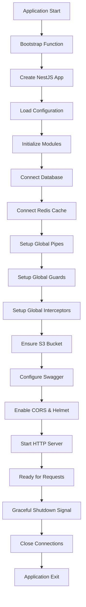
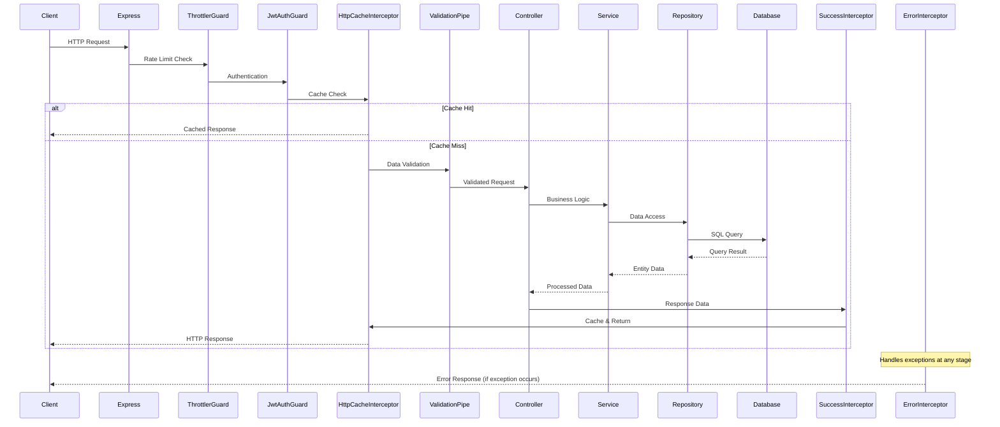

# Lifecycle NestJS

Dokumentasi komprehensif lifecycle aplikasi NestJS untuk platform hiring. Mencakup application startup, request processing, observability, dan graceful shutdown dengan implementasi produksi yang teruji menggunakan Node.js, Express, TypeORM, MySQL, Redis, dan NestJS Logger.

## Daftar Isi

- [Arsitektur Singkat](#arsitektur-singkat)
- [Application Lifecycle](#application-lifecycle)
- [Request Lifecycle](#request-lifecycle)
- [Konfigurasi & Environment](#konfigurasi--environment)
- [Observability](#observability)
- [Error Handling](#error-handling)
- [Contoh Kode Minimal](#contoh-kode-minimal)
- [Testing & Health](#testing--health)
- [Graceful Shutdown](#graceful-shutdown)
- [Checklist Produksi](#checklist-produksi)
- [Referensi Cepat](#referensi-cepat)

## Arsitektur Singkat

```
Bootstrap → Module Init → Resource Connections → HTTP Server → Request Processing → Graceful Shutdown
```

| Komponen            | Peran                                      | Kapan Dijalankan                      |
| ------------------- | ------------------------------------------ | ------------------------------------- |
| **ConfigModule**    | Environment validation & configuration     | Module initialization                 |
| **TypeORM**         | Database connection & entity management    | Module initialization                 |
| **CacheModule**     | Redis connection & caching layer           | Module initialization                 |
| **JwtModule**       | Token verification & security              | Module initialization                 |
| **ThrottlerModule** | Rate limiting protection                   | Per request                           |
| **Guards**          | Authentication & authorization             | Per request, before controller        |
| **Interceptors**    | Response transformation & error handling   | Per request, around controller        |
| **Pipes**           | Validation & data transformation           | Per request, before controller method |
| **Controllers**     | Route handling & business logic delegation | Per request                           |
| **Services**        | Business logic & external integrations     | Per request                           |
| **Repositories**    | Data access & database operations          | Per request                           |

## Application Lifecycle



### Startup Hooks

1. **Bootstrap Phase**
   - Logger initialization dengan context-specific naming
   - NestJS application factory dengan custom logger levels

2. **Configuration Phase**
   - Environment variable loading dari `.env`
   - Schema validation dengan Joi untuk type safety
   - Service configuration dengan dependency injection

3. **Module Initialization**
   - ConfigModule: Global environment access
   - TypeORM: MySQL connection dengan entity auto-discovery
   - CacheModule: Redis integration dengan Keyv
   - JwtModule: Token signing/verification setup
   - ThrottlerModule: Rate limiting dengan 100 req/min default

4. **Resource Setup**
   - Database connection establishment
   - Redis cache store connection
   - S3 bucket availability verification
   - Global validation pipes dengan DTO transformation

5. **Security & Middleware**
   - JWT authentication guard registration
   - Rate limiting guard activation
   - CORS enablement untuk cross-origin requests
   - Helmet security headers

6. **Development Tools**
   - Swagger API documentation pada non-production
   - Request/response logging dengan structured format

## Request Lifecycle



### Request Processing Order

1. **ThrottlerGuard**: Rate limiting validation (100 req/min)
2. **JwtAuthGuard**: Bearer token verification & user extraction
3. **HttpCacheInterceptor**: GET request caching dengan user-specific keys
4. **ValidationPipe**: DTO validation dengan class-validator
5. **Controller**: Route handler execution
6. **Service**: Business logic processing
7. **Repository**: Database operations dengan TypeORM
8. **SuccessResponseInterceptor**: Response standardization
9. **ErrorResponseInterceptor**: Exception handling & logging

## Konfigurasi & Environment

### Prioritas Konfigurasi

1. Environment variables (`.env` file)
2. Schema defaults (Joi validation)
3. Service-specific defaults

### Contoh .env.example

```bash
# Server Configuration
NODE_ENV=development
PORT=3000

# Database
MYSQL_HOST=localhost
MYSQL_PORT=3306
MYSQL_USER=root
MYSQL_PASSWORD=password
MYSQL_DATABASE=hiring_platform
MYSQL_LOGGING=true

# Cache
REDIS_URL=redis://localhost:6379/0
CACHE_TTL_MS=60000

# Authentication
JWT_SECRET=your-secret-key
JWT_EXPIRES_IN=24h

# Storage
AWS_ACCESS_KEY_ID=your-access-key
AWS_SECRET_ACCESS_KEY=your-secret-key
AWS_REGION=us-east-1
AWS_S3_BUCKET=hiring-platform-bucket
```

### Validasi Schema

```typescript
// Schema validation dengan Joi untuk type safety
const configSchema = Joi.object({
  NODE_ENV: Joi.string().valid('development', 'staging', 'production'),
  PORT: Joi.number().default(3000),
  MYSQL_HOST: Joi.string().required(),
  // ... other validations
});
```

## Observability

### Logging Terstruktur

```typescript
// Consistent logging dengan context
const logger = new AppLogger('ServiceName');
logger.info('Request processed', { requestId, userId, duration });
logger.error('Database error', { error: err.message, stack: err.stack });
```

### Log Levels & Format

- **debug**: Development debugging information
- **info**: Normal application events
- **warn**: Recoverable issues
- **error**: Exception handling dengan stack traces
- **fatal**: Critical errors requiring intervention

### Metrics & Monitoring

- **Rate Limiting**: Built-in throttling dengan configurable limits
- **Cache Hit/Miss**: Redis performance monitoring
- **Database Queries**: TypeORM logging untuk slow query detection
- **Request Duration**: Express middleware timing
- **Error Rates**: Exception frequency tracking

### Health Checks

```typescript
// Health endpoint implementation
@Get('/health')
async health(): Promise<{ status: string; timestamp: string }> {
  return {
    status: 'healthy',
    timestamp: new Date().toISOString(),
  };
}
```

## Error Handling

### Standar Respons Error

```typescript
// Consistent error response format
{
  "statusCode": 400,
  "error": "BadRequestException",
  "message": "Validation failed",
  "details": {
    "field": "email",
    "value": "invalid-email"
  }
}
```

### Exception Mapping

- **HttpException**: Preserved dengan structured response
- **ValidationError**: Transformed dengan field-specific details
- **DatabaseError**: Generic internal server error untuk security
- **UnauthorizedException**: JWT verification failures
- **ThrottlerException**: Rate limit exceeded responses

### Error Interceptor Flow

1. Catch all exceptions di aplikasi boundary
2. Log error dengan stack trace untuk debugging
3. Transform ke structured response format
4. Preserve HTTP status codes
5. Sanitize sensitive information dari client exposure

## Contoh Kode Minimal

### main.ts Bootstrap

```typescript
async function bootstrap(): Promise<void> {
  const logger = new AppLogger(bootstrap.name);

  const app = await NestFactory.create(AppModule, {
    logger: ['debug', 'log', 'warn', 'error', 'fatal'],
  });

  // Global validation pipeline
  app.useGlobalPipes(
    new ValidationPipe({
      whitelist: true,
      forbidNonWhitelisted: true,
      transform: true,
    }),
  );

  // Security middleware
  app.enableCors();
  app.use(helmet());

  await app.listen(PORT);
  logger.info(`Application listening at http://localhost:${PORT}`);
}
```

### Controller Example

```typescript
@Controller('users')
@UseGuards(JwtAuthGuard)
export class UserController {
  constructor(private readonly userService: UserService) {}

  @Get(':id')
  @UseInterceptors(CacheInterceptor)
  async findOne(@Param('id') id: string): Promise<UserResponseDto> {
    return this.userService.findOne(id);
  }

  @Post()
  async create(@Body() createUserDto: CreateUserDto): Promise<UserResponseDto> {
    return this.userService.create(createUserDto);
  }
}
```

### Service dengan Transaction

```typescript
@Injectable()
export class UserService {
  constructor(
    @InjectRepository(User)
    private readonly userRepository: Repository<User>,
    private readonly cacheService: CacheHelperService,
  ) {}

  async findOne(id: string): Promise<User> {
    const cacheKey = `user:${id}`;

    return this.cacheService.getOrSet(
      cacheKey,
      async () => {
        const user = await this.userRepository.findOneBy({ id });
        if (!user) {
          throw new NotFoundException('User not found');
        }
        return user;
      },
      60000, // 1 minute TTL
    );
  }

  async create(createUserDto: CreateUserDto): Promise<User> {
    return withTransaction(this.userRepository.manager, async (manager) => {
      const user = manager.create(User, createUserDto);
      return manager.save(user);
    });
  }
}
```

## Testing & Health

### E2E Test Example

```typescript
describe('User API (e2e)', () => {
  let app: INestApplication;
  let authToken: string;

  beforeAll(async () => {
    const moduleFixture = await Test.createTestingModule({
      imports: [AppModule],
    }).compile();

    app = moduleFixture.createNestApplication();
    await app.init();

    // Authenticate for protected endpoints
    const authResponse = await request(app.getHttpServer())
      .post('/auth/login')
      .send({ email: 'test@example.com', password: 'password' });

    authToken = authResponse.body.data.accessToken;
  });

  it('/users (GET)', () => {
    return request(app.getHttpServer())
      .get('/users')
      .set('Authorization', `Bearer ${authToken}`)
      .expect(200)
      .expect((res) => {
        expect(res.body.statusCode).toBe(200);
        expect(res.body.data).toBeDefined();
      });
  });
});
```

### Health Check Endpoint

```typescript
@Controller()
export class AppController {
  @Get('/health')
  @HttpCode(200)
  health(): { status: string; timestamp: string; services: Record<string, string> } {
    return {
      status: 'healthy',
      timestamp: new Date().toISOString(),
      services: {
        database: 'connected',
        cache: 'connected',
        storage: 'available',
      },
    };
  }
}
```

## Graceful Shutdown

### Shutdown Hooks

```typescript
// In main.ts - enable graceful shutdown
app.enableShutdownHooks();

// Service cleanup implementation
@Injectable()
export class DatabaseService implements OnModuleDestroy {
  async onModuleDestroy(): Promise<void> {
    await this.connection.close();
  }
}
```

### Signal Handling

```bash
# Production deployment dengan graceful shutdown
# SIGTERM: Graceful shutdown (30s timeout)
# SIGINT: Immediate shutdown for development

docker run --init your-app  # Proper signal forwarding
```

### Connection Cleanup

1. **HTTP Server**: Stop accepting new connections
2. **Database**: Close connection pool dengan transaction completion
3. **Redis**: Flush pending operations & close connections
4. **File Uploads**: Complete pending S3 operations
5. **Background Tasks**: Cancel atau complete gracefully

### Timeout Configuration

- **Graceful Shutdown**: 30 seconds maximum
- **Database Timeout**: 10 seconds per connection
- **Cache Timeout**: 5 seconds for Redis operations
- **HTTP Timeout**: 15 seconds untuk request completion

## Checklist Produksi

### Pre-Deployment Verification

- [ ] Environment variables configured & validated
- [ ] Database migrations executed successfully
- [ ] Redis connection established & tested
- [ ] S3 bucket permissions verified
- [ ] SSL certificates installed & valid
- [ ] Rate limiting configured appropriately
- [ ] Logging levels set to production mode
- [ ] Health check endpoints responding
- [ ] Error monitoring configured
- [ ] Backup strategy implemented

### Performance Optimization

- [ ] Database indexes optimized
- [ ] Redis caching strategy implemented
- [ ] HTTP compression enabled
- [ ] Static asset CDN configured
- [ ] Connection pooling tuned
- [ ] Memory limits configured
- [ ] CPU profiling completed

### Security Hardening

- [ ] JWT secret rotated & secured
- [ ] Database credentials encrypted
- [ ] API endpoints rate limited
- [ ] CORS policies restrictive
- [ ] Helmet security headers enabled
- [ ] Input validation comprehensive
- [ ] Error messages sanitized

## Referensi Cepat

| Hook/Komponen                  | Tanggung Jawab                    | Execution Order         |
| ------------------------------ | --------------------------------- | ----------------------- |
| **bootstrap()**                | Application initialization        | 1                       |
| **ConfigModule**               | Environment loading & validation  | 2                       |
| **TypeORM**                    | Database connection establishment | 3                       |
| **CacheModule**                | Redis store configuration         | 4                       |
| **ThrottlerGuard**             | Rate limiting enforcement         | Per request - 1         |
| **JwtAuthGuard**               | Authentication verification       | Per request - 2         |
| **HttpCacheInterceptor**       | Response caching                  | Per request - 3         |
| **ValidationPipe**             | DTO validation & transformation   | Per request - 4         |
| **Controller**                 | Route handling                    | Per request - 5         |
| **Service**                    | Business logic execution          | Per request - 6         |
| **Repository**                 | Data persistence operations       | Per request - 7         |
| **SuccessResponseInterceptor** | Response standardization          | Per request - 8         |
| **ErrorResponseInterceptor**   | Exception handling                | Per request - Exception |
| **OnModuleDestroy**            | Resource cleanup                  | Shutdown                |

### Command Shortcuts

```bash
# Development
npm run start:dev          # Hot reload development
npm run test:e2e          # End-to-end testing
npm run lint              # Code quality check

# Production
npm run build             # TypeScript compilation
npm run start:prod        # Production server
npm run migration:run     # Database migrations

# Monitoring
npm run test:cov          # Coverage analysis
docker logs app-container # Application logs
```

### Environment Template

```bash
# Copy & configure for deployment
cp .env.example .env
# Edit required values
nano .env
# Validate configuration
npm run start
```

### Debugging Commands

```bash
# Database connection test
npm run typeorm -- query "SELECT 1"

# Redis connection test
redis-cli ping

# Health check verification
curl http://localhost:3000/health

# Memory usage monitoring
node --inspect-brk dist/main.js
```
